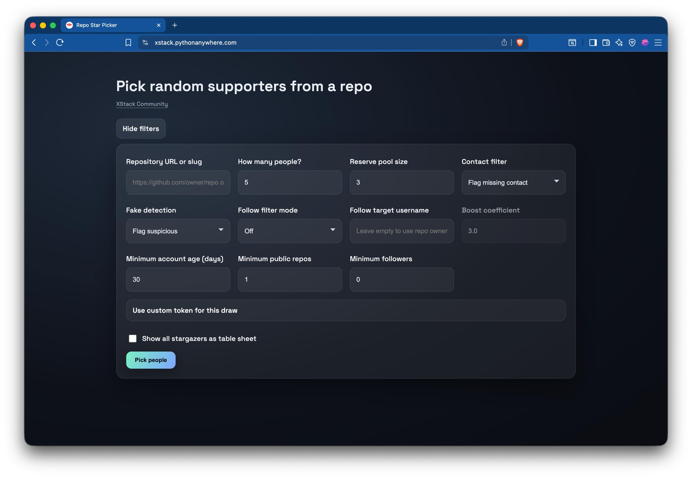

# Random Star Picker  
*Feb 15, 2026 | SEAL*  

## Star Picker

A handy tool for selecting a random set of supporters (stargazers) from a GitHub repository.

It includes several features to help you run and manage a lottery:

- **Flag / exclude suspicious accounts** by filtering on account age, number of repositories, or follower count  
- **Flag / exclude / boost** users who follow your profile  
- **Quick access** to supporters’ websites or social media  
- **Use your own GitHub token** to analyze larger repositories  
- **Summary report** of all supporters at the end  

Available on PythonAnywhere: [Random Star Picker](https://xstack.pythonanywhere.com/)
